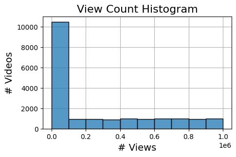
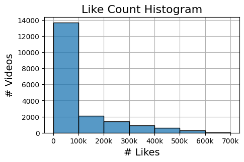

# TikTok Claims Classification and User Engagement Analysis

## Project Overview
This project focuses on building a machine learning model to classify TikTok user-submitted content into claims and opinions. Using a balanced dataset of over 19,000 videos, key video features were analyzed such as view counts, video duration and like counts. The project explored the relationship between user verification status and video engagement metrics, ultimately developing models that predict verified status and classify claims. Our final model, based on Random Forest, achieved a high recall score of 99%, ensuring effective differentiation between claims and opinions for enhanced content moderation.

## Business Understanding
### Stakeholders
The primary stakeholders are TikTok's data and content moderation teams, who aim to identify and manage videos that potentially violate terms of service. Accurate classification of user-generated content helps ensure that claims are scrutinized appropriately while opinions remain unflagged.

### Business Problem
Videos that make factual claims, as opposed to expressing opinions, may contain content that violates TikTok’s terms of service. An effective classification system is required to differentiate between claims and opinions, enabling targeted review of potentially problematic content and ensuring a safe community environment. Additionally, understanding how video features impact engagement for verified and unverified users provides insights that can help refine TikTok's content strategies.

## Data Understanding
### Data Source
The dataset consists of over 19,000 TikTok videos, categorized into claims and opinions (9,608 claims and 9,476 opinions). The data includes features such as:
- **Video Views**: Total views a video has received.
- **Video Duration**: Length of the video in seconds.
- **Engagement Metrics**: Like counts, comment counts and share counts.
- **User Verification Status**: Whether the video was posted by a verified or unverified account.

### Data Limitations
- **Missing Data**: Some videos have incomplete data, particularly for engagement metrics like likes and comments. Further analysis is required to understand and address these gaps.
- **Skewed Distributions**: View and like counts for opinion videos are right-skewed, with most clustering below 1,000. This skewness influenced the choice of modeling techniques.
- **Temporal Context**: Data represents a specific period and may not reflect seasonal trends or shifts in user behavior.

## Modeling and Evaluation
### Exploratory Data Analysis
- Analyzed the distribution of key engagement metrics.
- Identified that videos from unverified accounts tend to have higher average view counts compared to those from verified accounts.
- Conducted hypothesis testing to confirm the statistical significance of these differences.

### Regression Model: Predicting Verification Status
- Developed a logistic regression model to predict whether a user is verified based on video features.
- Key findings:
  - Opinion videos significantly increase the likelihood of verification.
  - Longer video durations slightly decrease the likelihood of a user being verified.
- Model Performance:
  - **Precision**: 63%
  - **Recall**: 82%
  - **Accuracy**: 67%

### Classification Model: Differentiating Claims and Opinions
- Implemented two classification models: **Random Forest** and **XGBoost**.
- Evaluated model performance on validation and test datasets.
- The **Random Forest** model was selected for its superior recall score of 99%, minimizing false negatives in identifying claim videos.
- Testing on holdout data confirmed high accuracy, with a few misclassified instances.

## Conclusion
The analysis demonstrated that videos with higher engagement metrics (e.g., views, likes, shares) are more likely to contain claims. The selected Random Forest model provides a robust solution for classifying content, enabling TikTok to better manage user-submitted claims and improve content review processes.

### Recommendations and Future Steps
- **Model Deployment**: Evaluate the Random Forest model's performance on diverse user subsets to ensure robustness across different content types.
- **Monitor Engagement Trends**: Regularly update the model with new data to capture shifts in user behavior and maintain high predictive performance.
- **Further Analysis**: Investigate the behavior of unverified accounts and their higher engagement, exploring potential ties to content strategies or bot-like activity.
- **Expand Features**: Incorporate additional features like video tags or user demographics to enhance model accuracy and understand deeper engagement patterns.

---

This README should provide a comprehensive overview of your project, helping potential employers or collaborators quickly grasp the scope and significance of your work. Adjust any sections as needed for your specific analysis and findings!
